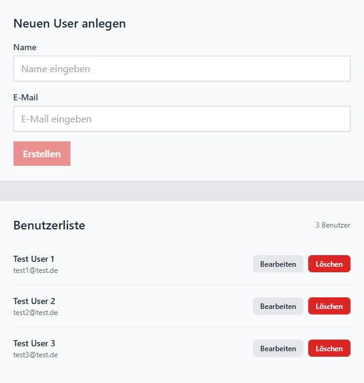
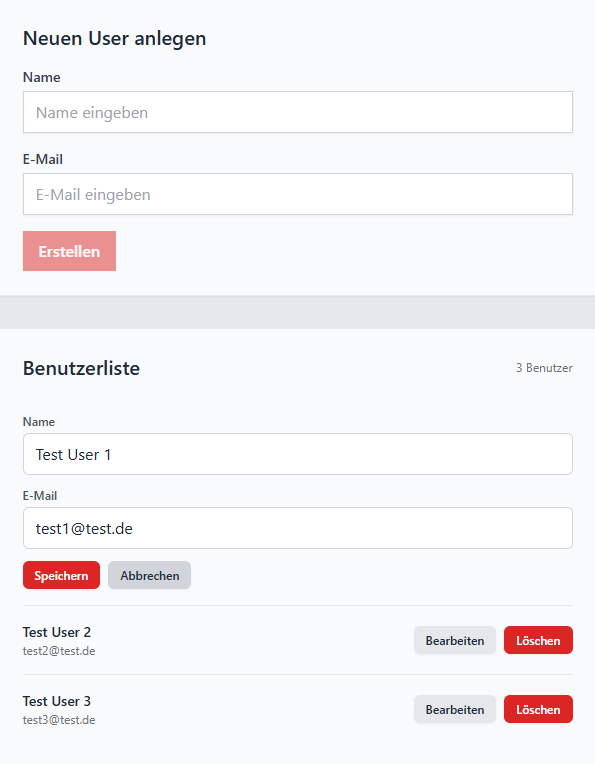

# Usermanagement SPA
## Vue3 - Vite - Apollo-Graphql - Tailwind

```bash
cd <folder>.git
npm install
```
### Starting App
```bash
npm run dev
```
### Open App
```bash
http://localhost:5173/
```
### SPA 1


### SPA 2
